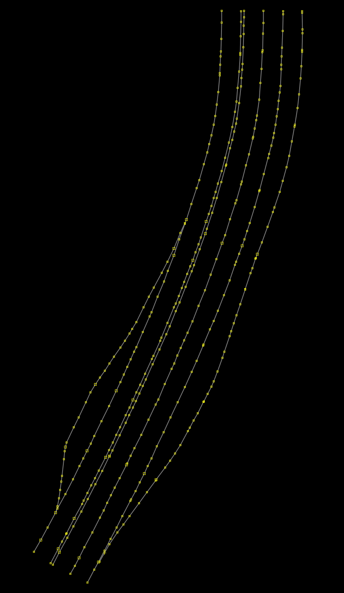
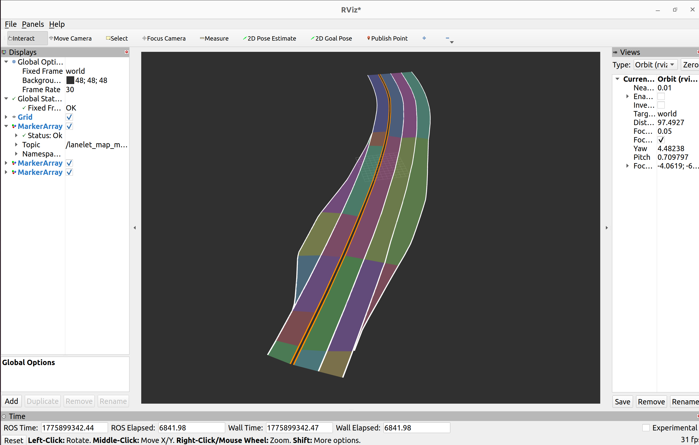
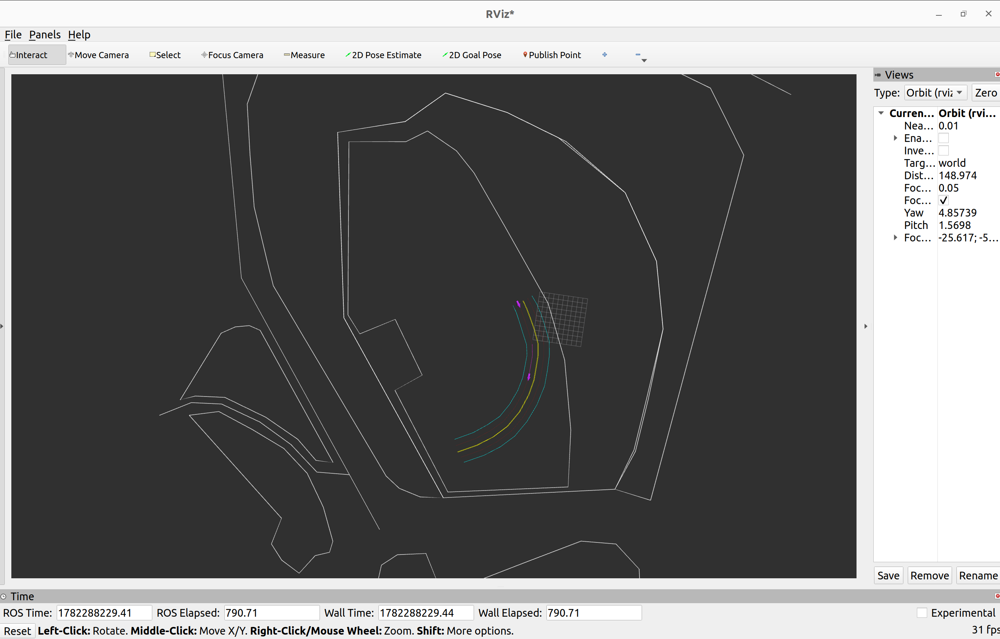
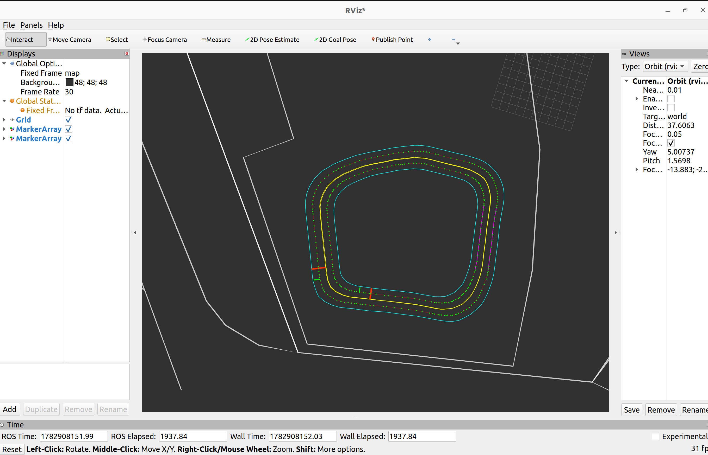

# Lanelet2 HD Map 제작 연습

## 1. 프로젝트 개요

이 저장소는 JOSM을 이용해 Lanelet2 기반 HD Map을 제작하는 연습 과정을 기록하기 위한 저장소입니다.

현재는 국토지리정보원에서 제공하는 K-City 지도 파일의 일부 구간을 이용해 Lanelet2 구조를 연습하고 있으며, 동국대학교 만해광장 지도를 기반으로 간단한 Lanelet2 HD Map을 제작해보았습니다.


---

## 2. 프로젝트 목표

이 프로젝트의 주요 목표는 다음과 같습니다.

* JOSM을 이용한 HD Map 편집 과정 학습
* Lanelet2 지도 구조 이해
* 도로의 좌우 경계선을 이용한 lanelet relation 생성
* `left`, `right`, `type=lanelet`, `subtype=road` 등 Lanelet2 기본 태그 분석
* K-City 일부 구간을 이용한 Lanelet2 태그 적용 연습
* 동국대학교 만해광장 간단한 HD Map 제작
* ROS2 및 RViz에서 Lanelet2 지도 시각화 

---

## 3. Lanelet 연습

### 3.1 K-City 일부 구간 Lanelet2 연습

국토지리정보원에서 제공해주는 K-City 벡터 데이터의 극히 일부 구간만 추출하여 Lanelet2 구조를 연습했습니다.

이 과정에서 다음 내용을 연습했습니다.

* 도로 좌측 boundary way 생성
* 도로 우측 boundary way 생성
* 좌우 boundary way를 이용한 lanelet relation 생성
* relation member의 role을 `left`, `right`로 지정
* Lanelet2 형식의 OSM XML 구조 확인

사용 파일:

* `partial_lanelet2.osm`

<p align="center">
  
</p>



---

### 3.2 동국대학교 만해광장 HD Map 제작 연습

JOSM에서 동국대학교 만해광장 지도를 불러와 간단한 Lanelet2 HD Map을 제작했습니다.

이 과정에서 다음 내용을 연습했습니다.

* JOSM에서 실제 공간 지도 불러오기
* 도로 형태를 기준으로 boundary way 생성
* 좌우 boundary를 이용한 lanelet relation 생성
* Lanelet2 기본 태그 적용
* OSM 파일로 저장 후 추후 ROS2에서 사용할 수 있는 형태로 정리

사용 파일:

* `manhae_practice1.osm`
* `manhae_practice2.osm`




빨간선은 정지선, 초록선은 신호등, 보라색 선은 속도 제한 구역을 나타내며 초록색 점은 레엔렛의 중간 지점을 나타냅니다.


---

### 3.3 RViz 시각화

JOSM에서 작성한 Lanelet2 OSM XML 파일이 ROS2 환경에서도 정상적으로 활용될 수 있는지 확인하기 위해 Python 기반 시각화 노드를 작성했습니다.

해당 노드에서는 OSM XML 파일을 파싱하여 node, way, relation 정보를 읽고, 그중 type=lanelet으로 지정된 lanelet relation을 추출했습니다. 이후 각 lanelet relation에 포함된 left boundary way와 right boundary way를 읽어 좌우 경계선을 RViz2의 MarkerArray 형태로 시각화했습니다.

OSM 파일의 node 좌표는 위도와 경도 형태로 저장되어 있기 때문에, RViz2에서 바로 사용하기에는 적합하지 않았습니다. 따라서 Lanelet2의 `Origin`과 `UtmProjector`를 사용해 기준 원점을 설정하고, 각 node의 위도/경도 값을 UTM 기반의 map 좌표계로 변환했습니다. 변환된 x, y 좌표를 `geometry_msgs/Point`로 저장한 뒤 MarkerArray에 넣어 RViz2의 `map` frame에서 시각화했습니다.

좌우 boundary way를 중심으로 시각화했으며, manhae2 파일에서는 신호등과 정지선, 속도 제한 구역까지 만들어보았습니다.

---

## 4. Lanelet2 기본 구조

Lanelet2에서 하나의 주행 가능 도로 구간은 보통 하나의 선이 아니라, 좌우 경계선으로 둘러싸인 영역으로 표현됩니다.

기본 구조는 다음과 같습니다.

* 왼쪽 경계선 way
* 오른쪽 경계선 way
* lanelet relation

lanelet relation의 기본 태그 예시는 다음과 같습니다.

```xml
<relation id="...">
  <member type="way" ref="..." role="left"/>
  <member type="way" ref="..." role="right"/>
  <tag k="type" v="lanelet"/>
  <tag k="subtype" v="road"/>
</relation>
```

여기서 `left`와 `right`는 차량 진행 방향을 기준으로 구분합니다.

---


## 5. 사용 도구

* JOSM
* Lanelet2
* OSM XML
* ROS2 Humble
* RViz2
* Python
